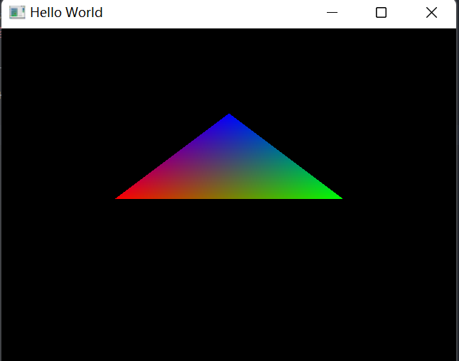
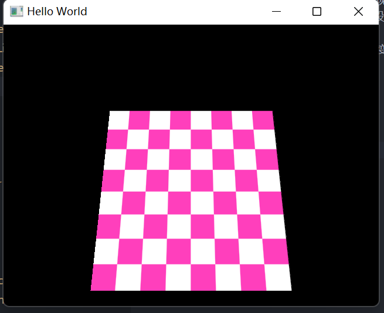

# SoftRenderer
可编程渲染管线的代码实现  
## 介绍
实现了基于右手系的渲染管线，实现了纹理的绘制。  
* 支持c++变现的顶点着色器和片段着色器
* 纹理支持二次线性插值
* 实现基础的矩阵运算，以及空间变换的矩阵运算
## 编译运行
支持vs、gcc编译器，支持跨平台
在目录下输入以下命令
~~~c++
mkdir build
cmake ..
~~~
## Example
* triangle  

* texture

* model

## TODO
1. camera
2. 修复纹理采样的边缘bug